# Tenant Configuration Audit Report

**Project:** College Management System  
**Audit Focus:** Is tenant-based institution naming implemented or hardcoded?  
**Date:** 2026-04-22  
**Auditor:** AI Code Audit  

---

## 1. Executive Summary

The system is **partially tenant-aware**. A robust `ConfigService` backed by a database-driven `Configuration` model with per-tenant scoping (`tenant_key`) **already exists and is actively used** by several subsystems (student profiles, ID cards, notification events). However, the **timetable PDF export service** — the feature that triggered this audit — **does not pass `tenant_key`** when calling `ConfigService.get()`, meaning it falls back to a global config lookup. Worse, the global config likely has no seeded rows for `university_name` / `school_name`, so the hardcoded fallback string `"VELS INSTITUTE OF SCIENCE, TECHNOLOGY & ADVANCED STUDIES (VISTAS)"` is what actually renders into the PDF. Additionally, multiple other values in the PDF (signature labels, lunch break time, document title) are fully hardcoded with no config at all. **Confidence: High** — verified by reading all relevant source files line-by-line.

---

## 2. ConfigService Analysis

### Implementation

| Aspect | Finding |
|---|---|
| **File** | [configuration/services/config_service.py](file:///c:/Users/Sriram/Downloads/College-Management-System-Backend/configuration/services/config_service.py) |
| **Storage** | Database table `Configuration` (Django ORM model) |
| **Lookup Method** | `ConfigService.get(key, default, tenant_key=None, sub_app="global")` |
| **Scoping Strategy** | If `tenant_key` is provided, filter by `tenant_key` first. If no match, fall back to global (`tenant_key IS NULL`). If no global, use `default` parameter. |
| **Tenant key source** | `TenantService.get_tenant_key(user)` returns `user.department.code` (e.g., `"CSE"`, `"ECE"`) |

### How Resolution Works (Lines 6-23)

```python
# Step 1: Query all active configs matching key + sub_app
scoped_qs = Configuration.objects.filter(key=key, sub_app=sub_app, is_active=True)

# Step 2: If tenant_key provided, try tenant-specific row first
if tenant_key:
    tenant_match = scoped_qs.filter(tenant_key=tenant_key).first()
    if tenant_match:
        return tenant_match.value  # Tenant-specific value wins

# Step 3: Fall back to global row (tenant_key IS NULL)
global_match = scoped_qs.filter(tenant_key__isnull=True).first()
if global_match:
    return global_match.value  # Global value

# Step 4: Fall back to hardcoded default parameter
return default  # Python-level hardcoded default
```

### Analysis

The architecture is **well-designed**. The `tenant_key` field uses the department code as a soft-tenant identifier. The `TenantService` utility correctly derives this from the authenticated user. The `Configuration` model has a `UniqueConstraint` on `(tenant_key, sub_app, key)` and a composite index, confirming this was intentionally designed for multi-tenant lookups.

**The critical gap**: callers must explicitly pass `tenant_key` for tenant scoping to activate. Without it, only global or default values are returned.

> [!IMPORTANT]
> **Verdict**: Tenant-scoped infrastructure exists (the plumbing is correct), but the PDF export caller does NOT opt-in, rendering it effectively a global singleton for that feature.

---

## 3. Hardcoded Institution Values Found

| File | Line | Hardcoded Value | Severity |
|---|---|---|---|
| `timetable/services.py` | 691 | `"VELS INSTITUTE OF SCIENCE, TECHNOLOGY & ADVANCED STUDIES (VISTAS)"` | 🔴 Critical — PDF header fallback |
| `timetable/services.py` | 692 | `"SCHOOL OF MANAGEMENT STUDIES AND COMMERCE"` | 🔴 Critical — PDF header fallback |
| `timetable/services.py` | 849 | `"CLASS TIME TABLE"` | 🟡 Warning — hardcoded PDF title (not parameterized) |
| `timetable/services.py` | 792 | `'12.00- 12.30'` — lunch break time | 🟡 Warning — hardcoded in PDF grid (comment says "Can be dynamic") |
| `timetable/services.py` | 909 | `"SIGNATURE OF THE FACULTY"` | 🟡 Warning — hardcoded PDF footer signature label |
| `timetable/services.py` | 910 | `"SIGNATURE OF THE HOD"` | 🟡 Warning — hardcoded PDF footer signature label |
| `timetable/services.py` | 978 | `"Timetable Violation Detected"` | 🟡 Warning — hardcoded notification title (not branded) |
| `timetable/views.py` | 665 | `f"timetable_{section.name.replace(' ', '_')}.pdf"` | 🟡 Warning — PDF filename has no institution/dept context |

> [!NOTE]
> The `VELS` and `SCHOOL OF MANAGEMENT` strings appear **only** as fallback defaults in `ConfigService.get()` calls. If corresponding `Configuration` database rows existed, they would be overridden. However, there is no evidence of seed data or a management command that creates these rows.

---

## 4. Tenant Model Presence

### Does a `Tenant` or `Institution` model exist?

**No.** There is no dedicated `Tenant`, `Institution`, or `University` model anywhere in the codebase.

| Check | Result |
|---|---|
| `core/models.py` — `Tenant` model | Not present |
| `core/models.py` — `Institution` model | Not present |
| `core/models.py` — `University` model | Not present |
| `User.tenant` FK | Not present |
| `User.institution` FK | Not present |
| `User.department` FK | **Present** (`core/models.py` line 176) |

### Does `User` have any tenant-like FK?

**Yes, indirectly.** `User` has a `department` FK to `Department`. The `TenantService` ([tenant_service.py](file:///c:/Users/Sriram/Downloads/College-Management-System-Backend/profile_management/services/tenant_service.py)) uses `department.code` as the tenant discriminator:

```python
class TenantService:
    @staticmethod
    def get_tenant_key(user=None):
        department = getattr(user, "department", None)
        if department and getattr(department, "code", None):
            return department.code  # e.g., "CSE", "ECE"
        return None
```

### Is `django-tenants` installed?

**No.** `django-tenants` and `django-tenant-schemas` are **not** present in any requirements file or `INSTALLED_APPS`. There is no `TENANT_MODEL` setting.

> [!WARNING]
> **Verdict**: Single-tenant with soft config-based department scoping. The system uses department codes as a lightweight tenant discriminator within a shared database schema. This is **not** true multi-tenancy (no schema isolation, no middleware-based tenant detection), but it is sufficient for department-level configuration customization within a single institution.

---

## 5. PDF Export Specific Analysis

Focus: `TimetableExportService.generate_pdf()` at [timetable/services.py:661-916](file:///c:/Users/Sriram/Downloads/College-Management-System-Backend/timetable/services.py#L661-L916)

### Value-by-Value Audit

| Value | Current Source | Line | Tenant-Scoped? |
|---|---|---|---|
| **University Name** | `ConfigService.get("university_name", "VELS...")` — **no `tenant_key` passed** | 691 | Global-only (falls to hardcoded default) |
| **School Name** | `ConfigService.get("school_name", "SCHOOL OF...")` — **no `tenant_key` passed** | 692 | Global-only (falls to hardcoded default) |
| **Department Name** | `section.course.department.name` — dynamically resolved from DB | 693 | Data-driven |
| **Semester/Year** | `semester.academic_year.year_code` + `semester.get_number_display()` | 850 | Data-driven |
| **Class & Section** | `section.name` | 851 | Data-driven |
| **In-Charge Name** | `SectionIncharge` query | 696-697 | Data-driven |
| **Room Number** | Aggregated from grid entries | 700-705 | Data-driven |
| **PDF Title** | Hardcoded `"CLASS TIME TABLE"` | 849 | Hardcoded |
| **Lunch Break Time** | Hardcoded `"12.00- 12.30"` | 792 | Hardcoded |
| **Signature Labels** | Hardcoded `"SIGNATURE OF THE FACULTY"` / `"SIGNATURE OF THE HOD"` | 909-910 | Hardcoded |
| **PDF Filename** | `timetable_{section_name}.pdf` — no institution/dept slug | views.py:665 | Not institution-scoped |
| **Institution Logo** | Not implemented at all | — | Missing |

### Call Path: View to Service

The [TimetableExportView](file:///c:/Users/Sriram/Downloads/College-Management-System-Backend/timetable/views.py#L598-L671) (`timetable/views.py` line 598) calls `TimetableExportService.generate_pdf(section_id, semester_id)`. The view **has the `request` object** and **does perform tenant isolation** (lines 634-649: verifies the HOD's department owns the section). However, it **does not pass the user or tenant context** into `generate_pdf()`, so the service has no way to resolve department-scoped config.

---

## 6. Where the Fix Should Be Applied

### 6a. ConfigService IS Tenant-Capable (Confirmed)

The infrastructure already exists. The fix is a **wiring problem**, not an architecture problem.

**Step 1:** Pass `tenant_key` to `ConfigService.get()` in `generate_pdf()`:

```diff
# timetable/services.py, line 684-692
 from configuration.services.config_service import ConfigService
+from profile_management.services.tenant_service import TenantService

# Inside generate_pdf(), after fetching section:
+dept_code = section.course.department.code  # This IS the tenant_key
 
-university_name = ConfigService.get('university_name', 'VELS INSTITUTE OF...')
-school_name = ConfigService.get('school_name', 'SCHOOL OF...')
+university_name = ConfigService.get('university_name', tenant_key=dept_code)
+school_name = ConfigService.get('school_name', tenant_key=dept_code)
+if not university_name or not school_name:
+    raise ValueError(
+        f"Missing institution config for department '{dept_code}'. "
+        "Seed 'university_name' and 'school_name' in Configuration admin."
+    )
```

**Step 2:** Seed configuration rows via a management command or Django Admin:

```python
# Example seed for department "CSE":
Configuration.objects.create(
    tenant_key="CSE",
    sub_app="global",
    key="university_name",
    value="VELS INSTITUTE OF SCIENCE, TECHNOLOGY & ADVANCED STUDIES (VISTAS)",
    is_active=True
)
Configuration.objects.create(
    tenant_key="CSE",
    sub_app="global",
    key="school_name",
    value="SCHOOL OF ENGINEERING",
    is_active=True
)
```

### 6b. View Signature (No Change Needed)

The `generate_pdf()` method currently takes `(section_id, semester_id)`. It should derive the department from `section` internally (which it already fetches), so **no view changes are needed** for tenant config — the fix is entirely inside the service.

### 6c. PDF Filename Fix

```diff
# timetable/views.py, lines 664-670
-filename = f"timetable_{section.name.replace(' ', '_')}.pdf"
+dept_slug = section.course.department.code.lower()
+section_slug = section.name.replace(' ', '_')
+filename = f"{dept_slug}_timetable_{section_slug}.pdf"
```

### 6d. Remaining Hardcoded Values

Move all remaining hardcoded strings to `ConfigService`:

```python
# Inside generate_pdf():
pdf_title = ConfigService.get('pdf_title', 'CLASS TIME TABLE', tenant_key=dept_code)
sig_faculty_label = ConfigService.get('pdf_sig_faculty', 'SIGNATURE OF THE FACULTY', tenant_key=dept_code)
sig_hod_label = ConfigService.get('pdf_sig_hod', 'SIGNATURE OF THE HOD', tenant_key=dept_code)
```

---

## 7. Risk Summary

| Risk | Impact | Affected Feature |
|---|---|---|
| Hardcoded `"VELS INSTITUTE..."` fallback in PDF header | 🔴 High — wrong branding if global config not seeded | PDF Export |
| Hardcoded `"SCHOOL OF MANAGEMENT..."` fallback in PDF | 🔴 High — wrong school name for all other departments | PDF Export |
| `ConfigService.get()` called **without** `tenant_key` in PDF | 🔴 High — tenant scoping infrastructure completely bypassed | PDF Export |
| No `Configuration` seed data / management command | 🔴 High — system relies on Python-level defaults, not DB | All config-driven features |
| Hardcoded `"CLASS TIME TABLE"` PDF title | 🟡 Medium — may not match other institution formats | PDF Export |
| Hardcoded lunch break time `"12.00- 12.30"` | 🟡 Medium — incorrect for institutions with different schedules | PDF Export |
| Hardcoded signature labels in PDF | 🟡 Medium — may not match institution conventions | PDF Export |
| Notification title `"Timetable Violation Detected"` not branded | 🟡 Medium — generic, not institution-branded | Notifications |
| PDF filename lacks institution/department context | 🟢 Low — functional but not professional | PDF Export |
| No institutional logo support in PDF | 🟢 Low — generic but acceptable for MVP | PDF Export |

---

## 8. Tenant-Scoped Callers vs Non-Scoped Callers

To understand the inconsistency, here is a comparison of modules that **do** pass `tenant_key` vs the PDF export which **does not**:

### Passes `tenant_key` (Correctly Tenant-Scoped)

| Module | File | Line | How tenant_key is derived |
|---|---|---|---|
| Student Profile Edit | `profile_management/services/student_service.py` | 76 | `TenantService.get_tenant_key(actor)` |
| Student Allowed Fields | `profile_management/services/student_service.py` | 35-39 | Passes `tenant_key` parameter |
| Student Photo Upload | `profile_management/services/student_service.py` | 103 | `TenantService.get_tenant_key(actor)` |
| Parent Service | `profile_management/services/parent_service.py` | 20, 61 | `TenantService.get_tenant_key(user)` |
| Faculty Service | `profile_management/services/faculty_service.py` | 95 | `TenantService.get_tenant_key(request_user)` |

### Does NOT Pass `tenant_key` (Global/Fallback Only)

| Module | File | Line | Impact |
|---|---|---|---|
| **PDF Export** | `timetable/services.py` | 691-692 | 🔴 Wrong institution name in PDF headers |
| ID Card PDF Layout | `onboarding/services/id_card_service.py` | 33 | 🟡 Falls to global default |
| ID Card QR TTL | `onboarding/services/id_card_service.py` | 74 | 🟡 Falls to global default |
| ID Card Format | `onboarding/services/id_card_service.py` | 101 | 🟡 Falls to global default |
| Notification Events | `notifications/services/event_dispatcher.py` | 13-14 | 🟡 Falls to global default |

---

## 9. Files That Need Changes (Final Checklist)

- [ ] **`timetable/services.py`** (lines 684-692) — Pass `tenant_key=section.course.department.code` to both `ConfigService.get()` calls. Remove hardcoded fallback strings. Raise `ValueError` if config missing.
- [ ] **`timetable/services.py`** (line 849) — Move `"CLASS TIME TABLE"` to `ConfigService.get('pdf_title', ..., tenant_key=dept_code)`
- [ ] **`timetable/services.py`** (line 792) — Derive lunch break time dynamically from `TimetableConfiguration` or `ConfigService`
- [ ] **`timetable/services.py`** (lines 909-910) — Move signature labels to `ConfigService`
- [ ] **`timetable/services.py`** (line 978) — Replace hardcoded notification title with `ConfigService.get('violation_notification_title', ...)`
- [ ] **`timetable/views.py`** (line 665) — Include department code in PDF filename
- [ ] **Django Admin / Management Command** — Create a `seed_institution_config` command that populates `Configuration` rows for each department's `university_name`, `school_name`, etc.
- [ ] **`onboarding/services/id_card_service.py`** (lines 33, 74, 86, 101, 108, 145) — Consider passing `tenant_key` for department-specific ID card configuration

> [!IMPORTANT]
> No changes are needed to `ConfigService` itself, `Configuration` model, or `TenantService`. The infrastructure is already correct — it's the **callers** that need to start using tenant scoping.

---

## 10. Architecture Diagram

```mermaid
flowchart TD
    subgraph "Current State - Broken Path"
        A["TimetableExportService.generate_pdf"] -->|"ConfigService.get university_name, VELS... -- NO tenant_key"| B["ConfigService"]
        B -->|"tenant_key is None -- skip tenant lookup"| C["Global Config Row - probably missing"]
        C -->|"No global row -- return default"| D["VELS INSTITUTE hardcoded fallback"]
    end

    subgraph "Fixed State - Correct Path"
        E["TimetableExportService.generate_pdf"] -->|"ConfigService.get university_name, tenant_key=CSE"| F["ConfigService"]
        F -->|"tenant_key=CSE -- filter Configuration table"| G["CSE-specific Config Row"]
        G -->|"Returns tenant value"| H["Correct institution name per department"]
    end

    subgraph "Already Working - Reference"
        I["StudentProfileService.update_profile"] -->|"ConfigService.get with tenant_key from TenantService"| J["ConfigService"]
        J -->|"Resolves CSE-specific config"| K["Correct dept-scoped result"]
    end
```


